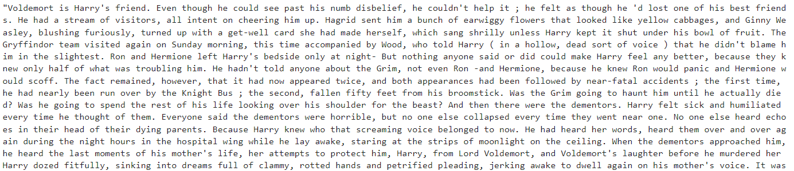

# CS505Project

Here is our project for CS505:

## Harry Potter's Adventure With GPT2 (Generative Pre-trained Transformer 2) And LSTM (Long short-term memory)!

## GPT-2 (Generative Pre-trained Transformer 2) Harry Potter Generated Text

## LSTM(Long short-term memory) Recurrent Neural Network Harry Potter Generated Text Model

